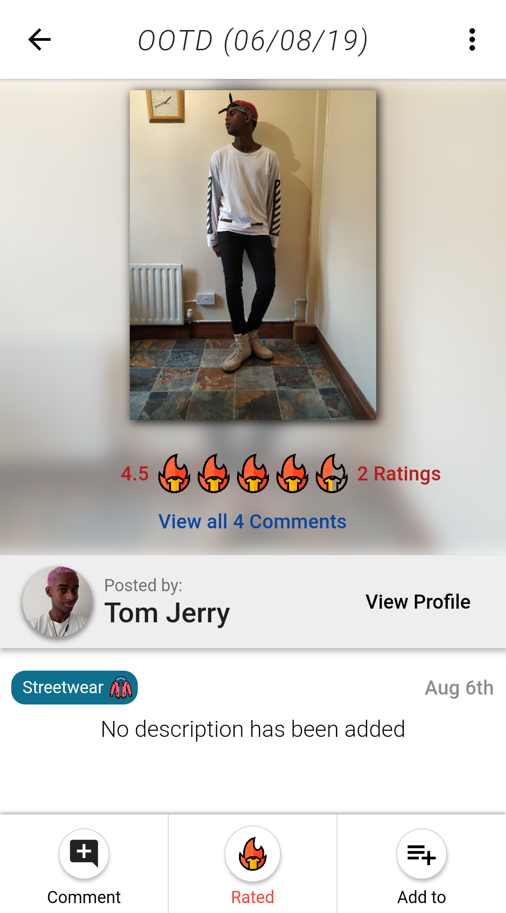
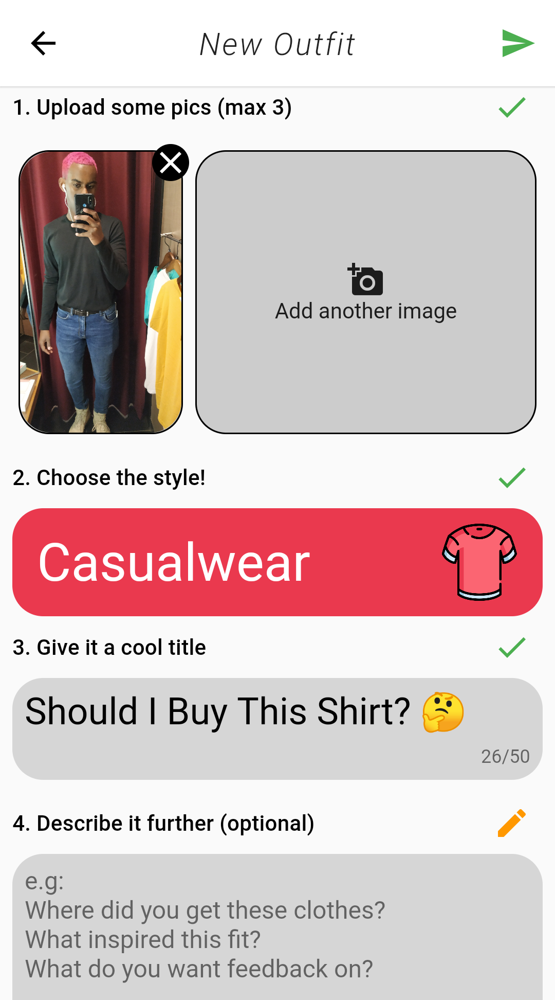
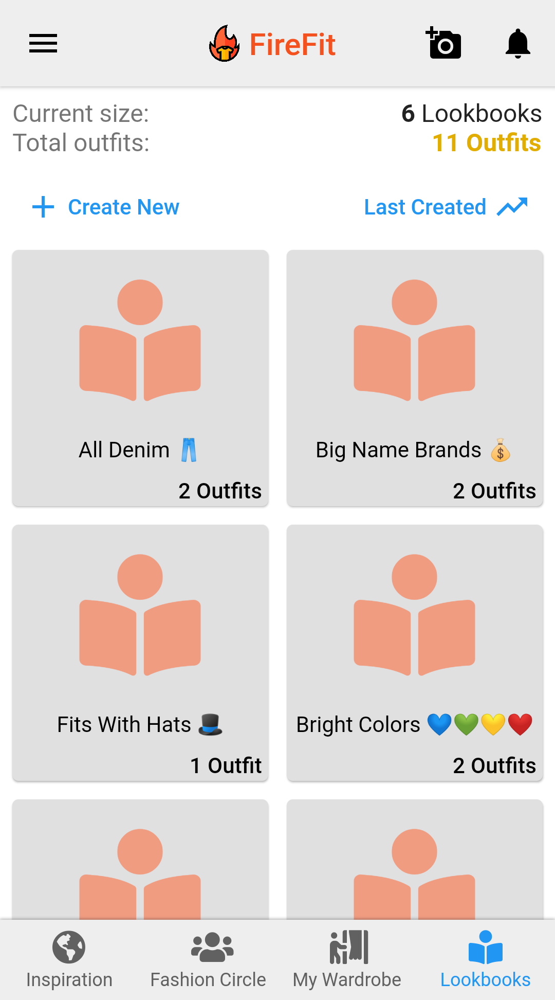

<div align="center">

# FireFit

**An offline-first fashion social network.** Flutter client for a platform where users post outfits, rate them, and discover what the world is wearing.

[](https://flutter.dev)
[](https://dart.dev)
[](https://firebase.google.com)
[]()

**Full-stack project — client and backend both designed and built solo.**
The companion [FireFit backend](https://github.com/hussien4321/FireFit-BackEnd) is 33 Cloud Functions in TypeScript over Google Cloud SQL, covering the ranked feed, social graph, notification fan-out and image pipeline.

Offline-first · four-layer architecture · [Website](https://skilful-tape-240120.web.app)

</div>

---

## Tech stack

| Concern | Choice |
|---|---|
| Framework | Flutter (Dart), Material |
| State management | BLoC pattern over `rxdart` |
| Local persistence | `sqflite` + `sqlbrite` (reactive SQLite) |
| Auth | Firebase Auth — email, Google, Facebook, Twitter |
| API | Firebase Cloud Functions (callable) |
| Media | Firebase Storage + on-device compression |
| Push | Firebase Cloud Messaging |
| Config & rollout | Firebase Remote Config |
| Observability | Firebase Analytics + Crashlytics |
| Monetisation | AdMob + in-app subscriptions |
| Database (server) | Google Cloud SQL (MySQL) |

---

## Technical highlights

| Area | Approach | |
|---|---|---|
| **Multi-feed cache** | The same outfit appears in up to five feeds at once. Storing copies invites drift; storing one copy makes eviction dangerous. Solved with reference counting in SQL. | [↓](#1-multi-feed-caching-with-reference-counting-in-sql) |
| **Optimistic rating updates** | Showing a new average instantly is easy on a first vote and fiddly when *changing* one — the old value has to be backed out of the mean first, without dividing by zero. | [↓](#2-optimistic-updates-with-aggregate-recomputation) |
| **Offline-first data flow** | The UI never consumes network responses. SQLite is the single source of truth and widgets update as a *consequence* of database writes, so cache and server responses share one code path. | [↓](#data-flow-the-database-is-the-single-source-of-truth) |
| **12-version schema migrations** | A cache still has to survive upgrades from any prior version, including devices that crashed mid-migration. | [↓](#3-twelve-version-schema-migration-ladder) |
| **Atomic multi-image publish** | An outfit with three images becomes visible after the first one lands, showing broken slots. Fixed with a publish barrier negotiated through a filename protocol. | [↓](#5-filename-encoded-upload-protocol) |
| **Reactive state, no framework** | Predates the modern Flutter state-management ecosystem. Hand-rolled BLoCs over `rxdart`; `OutfitBloc` alone coordinates 13 streams. | [↓](#4-reactive-state-management-without-a-framework) |

---

## Architecture

Four strictly separated layers. The dependency arrow only ever points inward: `front_end` → `blocs` → `middleware` ← `repository_impl`.

```
lib/
├── middleware/          Pure Dart. Entities, repository *interfaces*, request DTOs.
│                        Zero Firebase imports — the domain doesn't know the backend exists.
├── repository_impl/     Adapters. Cloud Functions + Storage + SQLite implementations
│                        of the middleware interfaces.
├── blocs/               State. rxdart sink/stream pairs, one BLoC per domain.
└── front_end/           UI. Screens + ~60 reusable widgets. Reads streams, writes sinks.
```

`middleware/repositories/outfit_repository.dart` defines a 25-method abstract contract. The UI compiles against that interface, never against `FirebaseOutfitRepository` — so swapping the backend, or substituting a fake in tests, is a one-line change in the injector.

### Data flow: the database is the single source of truth

This is the core design decision, and the one that made everything else tractable.

The UI **never** consumes network responses directly:

```
   ┌──────────────┐  writes   ┌────────────────┐  reactive query  ┌──────────┐
   │ Cloud        │ ────────► │ SQLite         │ ───────────────► │ BLoC     │
   │ Functions    │           │ (single source │                  │ streams  │
   └──────────────┘           │  of truth)     │                  └────┬─────┘
            ▲                 └────────────────┘                       │
            │                          ▲                               ▼
            │ mutations                │ optimistic write          ┌──────────┐
            └──────────────────────────┴────────────────────────── │ Widgets  │
                                                                   └──────────┘
```

`FirebaseOutfitRepository` fetches from Cloud Functions and writes results into SQLite. It returns nothing to the UI. `sqlbrite` wraps the database with reactive queries that re-emit whenever a watched table is written, so the widget tree updates as a *consequence* of the database changing.

The payoff: every screen renders from cache on launch, optimistic updates and server confirmations travel the exact same code path, and there is exactly one place where state can diverge.

---

## Implementation

### 1. Multi-feed caching with reference counting in SQL

The same outfit can legitimately appear in five feeds at once — Explore, your follow feed, your wardrobe, a lookbook, and a notification. Storing five copies invites drift. Storing one copy makes "clear the Explore feed" dangerous, because it might be the last thing holding an outfit another screen is currently showing.

The fix is an `outfit_search` join table mapping `(outfit_id, search_mode)`, with outfit rows stored exactly once. Evicting a feed becomes a reference-counted delete — remove the outfit **only** if this search mode is the sole remaining reference:

```sql
DELETE FROM outfit
WHERE (SELECT COUNT(*) FROM outfit_search
       WHERE search_outfit_id = outfit_id AND search_outfit_mode  = ?) = 1
  AND (SELECT COUNT(*) FROM outfit_search
       WHERE search_outfit_id = outfit_id AND search_outfit_mode != ?) = 0
```

One row per outfit, no duplication, no orphans, and refreshing one tab can never blank out another.

### 2. Optimistic updates with aggregate recomputation

Tapping a rating updates the displayed average instantly, before the network call resolves. That's trivial for a first-time vote and surprisingly fiddly when a user *changes* an existing one — the old value has to be backed out of the mean before the new one is folded in, while guarding the single-rating case where the divisor would hit zero:

```dart
if (outfit.hasRating) {
  average = total == 1 ? 0 : ((average * total) - outfit.userRating) / (total - 1);
  total--;
}
outfit.averageRating = ((average * total) + ratingValue) / (total + 1);
```

The same pattern covers comment counts, reply counts, lookbook sizes and the user's total flame count — each maintained as a local counter update, so no screen needs a refetch to stay correct.

New comments use a related trick: they're inserted immediately under a temporary client-side ID, then reconciled against the server's real ID (`UPDATE comment SET comment_id = ? WHERE comment_id = ?`) once the call returns. The comment appears instantly and its identity converges without the list ever flickering.

### 3. Twelve-version schema migration ladder

A cache schema still has to survive app updates on devices upgrading from any prior version. Migrations apply forward one step at a time from whatever version is found on disk, with a `skipUnnecessaryVersions` shortcut that collapses the early pre-release schemas into a single rebuild rather than replaying dead migrations, plus explicit downgrade handling.

`ALTER TABLE` steps are individually guarded so a partially-applied migration — from an upgrade that crashed halfway — doesn't brick the cache on the next launch.

### 4. Reactive state management without a framework

Written before the modern Flutter state-management ecosystem settled, the app uses hand-rolled BLoCs over `rxdart`. Each exposes `Sink`s for intent and `Stream`s for state: `BehaviorSubject` where a screen needs the current value on subscribe, `PublishSubject` for fire-and-forget events, `.distinct()` on input sinks to swallow duplicate loads from rapid taps, and every subscription tracked in a list for deterministic disposal.

`OutfitBloc` alone manages 13 independent streams — five feeds, per-feed loading flags, error and success channels — all fed from reactive database queries rather than imperative `setState` calls.

### 5. Filename-encoded upload protocol

Uploading is decoupled from the request/response cycle entirely. The client compresses images on-device, then writes them to a Storage staging path under a structured filename:

```
outfit:{outfitId}:{userId}:{imageIndex}:{imageCount}:{originalName}
```

A Storage trigger on the backend parses that filename, resizes, normalises EXIF rotation, moves the file to its permanent path and updates SQL — and when `imageIndex == imageCount`, it flips the outfit's `has_images_uploaded` flag and fans out push notifications to every follower.

Since all feed queries filter on that flag, a half-uploaded outfit is never visible to anyone. It's a publish barrier built out of a filename and a boolean, giving atomic-looking publication over a non-transactional multi-file upload.

---

## Main features

- **Outfit uploads** — up to three images per post, compressed on-device and tagged with one of six styles.
- **5-point "flame" rating** on every outfit, with a running average tracked per user over time.
- **Ranked discovery feed** ordered by a confidence-weighted score rather than a raw average.
- **Search and filtering** by style, gender, country and time window.
- **Follow system with push notifications** for new posts, ratings, comments and replies.
- **Threaded comments** with likes and notifications to everyone in a thread.
- **Lookbooks** — curated personal collections of saved outfits.
- **Moderation** — block and report users and outfits.
- **Offline-first browsing** served entirely from local SQLite.
- **Full account lifecycle** — email and social sign-in, verification, and account deletion.

FireFit has since been discontinued and removed from the stores; the client and backend are open-sourced as a portfolio piece.

| Explore — "Hottest Fits" | Rate a fit | Outfit detail |
|:---:|:---:|:---:|
|  |  |  |
| Ranked feed with style, gender, country and date filters | 5-flame rating with live average recalculation | Threaded advice, ratings breakdown, save-to-lookbook |

| Upload an outfit | My Wardrobe | Lookbooks | Profile |
|:---:|:---:|:---:|:---:|
|  |  |  |  |
| Up to 3 images, style tag, title, description | Every fit posted, with its score | Curated collections of saved looks | Followers, flames earned, upload streak |


---

## Getting started

> **Note:** this targets a pre-null-safety Dart SDK (`>=2.11.0 <3.0.0`) and depends on several Firebase plugin versions that have since been superseded. It builds against a Flutter 2.x toolchain and will not compile on current stable without a dependency upgrade pass.

```bash
git clone https://github.com/hussien4321/FireFit-Flutter.git
cd FireFit-Flutter
flutter pub get
```

Supply your own Firebase credentials, which are deliberately not committed:

- `android/app/google-services.json`
- `ios/Runner/GoogleService-Info.plist`

Then deploy the [backend](https://github.com/hussien4321/FireFit-BackEnd) so the callable functions the client expects exist.

```bash
flutter run
```

---

## License

Released as a portfolio piece. The app is discontinued and no longer operates a live backend.
